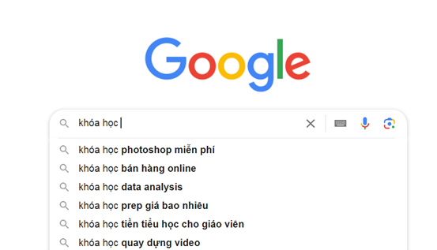
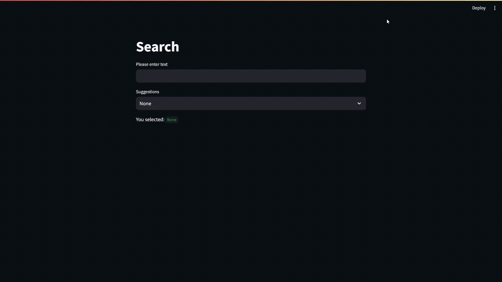
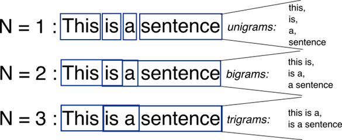
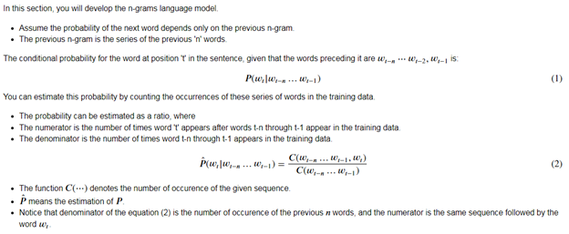
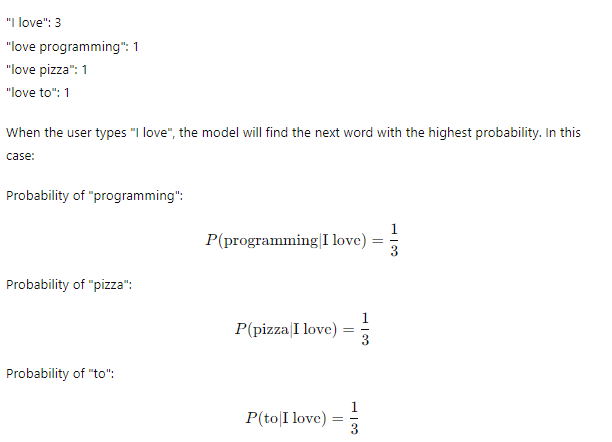
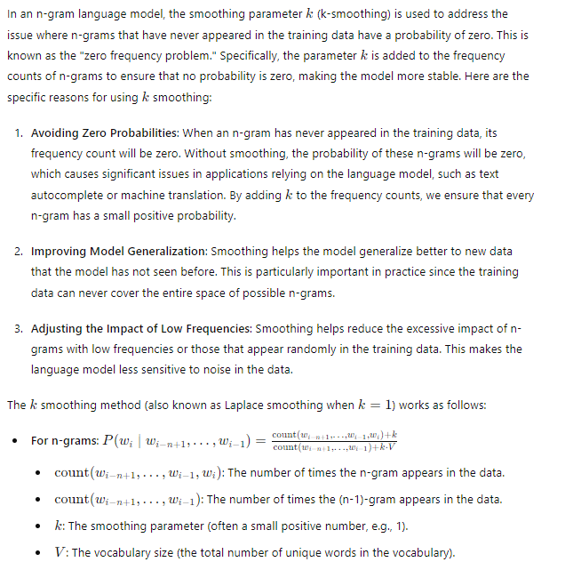

# Language Models: Auto-Complete

Auto-complete is an artificial intelligence technology that automatically suggests the next word when a user is typing a text. A common example and the most popular application of this technology is the keyword suggestion in Google's Search box or typing on a smartphone keyboard.

While there are many modern tools available, here we will discuss a foundational technology that underpins these new advancements. This classic technology is mentioned in the Coursera course: [Natural Language Processing](https://www.coursera.org/learn/probabilistic-models-in-nlp?specialization=natural-language-processing).

I will build a system almost similar to google's, it is used to illustrate the technique I am using, I just use python's steamlit library.

* Run app.py:
    + streamlit run app.py

## Technology: N-Gram

An N-gram is a contiguous sequence of n words from a given text. For example:

- Sentence: "I love programming"
  - 1-gram (unigram): "I", "love", "programming"
  - 2-gram (bigram): "I love", "love programming"
  - 3-gram (trigram): "I love programming"

Once we have the N-gram data set (N can be 1, 2, 3, 4, etc., depending on the setup and the coder's experiments), we calculate the probability of the next word appearing using the formula:

The formula may seem complex, but here is a simplified example:

The current probabilities are equal, meaning any word in: programming, pizza, or to could be the next word following the 2-gram "I love". If your data contains a word with the highest probability, it is the best choice to become the next word after "I love" (suggestion system).

The above content provides a general overview of how N-gram is applied in Auto-complete. Details about the system are presented in the code. Additionally, there is a complete interface illustration and a basic connection method between UI and UX to utilize Auto-complete.

In practice, different variations of the probability formula are used. Here, we employ the Laplace formula with a smoothing parameter k.

## Contact
    + UI Specialist: Ha Khai Hoan
    + Email: khaihoan.ai@gmail.com
    + GitHub: [Hoanha2101](https://github.com/Hoanha2101)